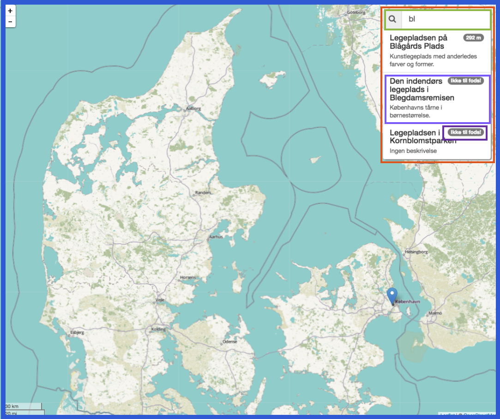

theme: Plain Jane, 1
autoscale: true


---
# Flemming Bregnvig


Freelance consultant with a big passion for TypeScript/JavaScript and related web technologies

Besides doing **consulting work** Flemming also takes the time to **teach** the exact same technologies to others.

LinkedIn:
[http://dk.linkedin.com/in/bregnvig](http://dk.linkedin.com/in/bregnvig)

Github:
[http://github.com/bregnvig](http://github.com/bregnvig)

---
# Jens Nerup


Freelance consultant with a passion for Objective C and Swift and their associated platforms such as iOS and macOS.

Even though the focus is native platforms there is always an eager to explore other platforms and technologies.

LinkedIn:
[http://dk.linkedin.com/in/barkoded](http://dk.linkedin.com/in/barkoded)

Github:
[http://github.com/barkoded](http://github.com/barkoded)

---


---


# What is TypeScript?
TypeScript is a superset of JavaScript which primarily provides optional **static typing**, **classes** and **interfaces**.

TypeScript compiles to **plain JavaScript** code which runs in any JavaScript engine that supports ECMAScript 3 (or newer).

---
## Why use TypeScript?

**Static typing** helps create more solid code[^1]. Due to TypeScripts static nature it enables **enhanced IDE support**, including **code completion** and **refactoring**

**Transpiling**. Use TypeScript to enable use of ECMAScript 2015 & 2017 in ECMAScript 5 environment

[^1]: **15% of bugs in JavaScript can be prevented by type safety**, Quantifying Detectable Bugs in JavaScript by Gao et al. (2017)

---

# Simple types - JavaScript

```javascript
function calculateVAT(amount) {
    return amount * 1.25;
}

console.log(calculateVAT(100));
// Wont work. You'll see the error at runtime
console.log(calculateVAT({amount: 100})); 
```
---

# Simple types - TypeScript

```typescript
function calculateVAT(amount: number): number {
    return amount * 1.25;
}

console.log(calculateVAT(100));

console.log(calculateVAT({amount: 100}));
// error TS2345: Argument of type '{ amount: number; }' 
// is not assignable to parameter of type 'number'.
```

---


## What is Angular?
### Angular is a ~~framework~~ development **platform** for building mobile and desktop applications. Angular lets you extend the HTML's syntax to express your application's components clearly and compact, using **TypeScript** or ~~JavaScript~~.

---
## Why use Angular?
### Large enterprise ~~web~~ applications can easily get messy. Angular helps you structure your code, separate your concerns and remove trivial boilerplate code.

---
# Alternatives

* AngularJS
* React
* vue.js
* Polymer
* jQuery + jQueryUI
* and others...

---
# Architecture Overview


---

# Components in a view



---
## Getting Started - Angular CLI
### A command line interface for Angular[^2]


[^2]:Prerequisite: Node.js must be install on your OS

---


## What is RxJS?

Reactive Programming is a way to work with composable asynchronous streams of data over time. 

**Observables** are the main data structure used in Reactive Programming.

---


---

# Sample of RxJS usage

---
# Filtering use case
## Filter playgrounds when the input filter field changes.

* Only do the filtering when something new has arrived, but do start with a initial empty search.
* Avoid bombardment of the server with requests, therefore wait for 200 ms after last input before doing the filtering.
* Next perform the case insensitive filtering, unless the input haven't changed else ignore the input.
* If we received new data, then perform the filtering with the latest set of playgrounds available.

---
# Imperative style

(Not handling new playgrounds)

```javascript
export class SidebarComponent implements OnInit {

  public playgrounds: Playground[];
  private timerNo: number = null;
  private previousSearch: string;

  constructor(private playgroundService: PlaygroundService, private locationService: LocationService) { }

  public ngOnInit() {
    this.doSearch('');
  }

  public doSearch(value: string) {
    value = value ? value.toLowerCase() : '';
    if (value === this.previousSearch) {
      return;
    }
    if (this.timerNo !== null) {
      window.clearTimeout(this.timerNo);
      this.timerNo = null;
    }
    this.timerNo = window.setTimeout(() => {
      this.previousSearch = value;
      const subscription = this.playgroundService.getPlaygrounds().subscribe(playgrounds => {
        this.playgrounds = playgrounds.filter(playground => playground.name.toLowerCase().includes(value));
        if (subscription) {
          subscription.unsubscribe();
        }
        this.timerNo = null;
      });
    }, 200);
  }
}
```

---
# Reactive style with RxJS

```javascript
const filter$ = this.filterControl
  .valueChanges                                           // New data has arrived
  .startWith('')                                          // The initial search
  .debounceTime(200)                                      // 200 ms of silence
  .distinctUntilChanged()                                 // Unless the input changed
  .map(text => text.toLocaleLowerCase())                  // Lowercase search input
  .combineLatest(this.playgroundService.getPlaygrounds(), // Fetch latest playgrounds
    (text, playgrounds) =>
      playgrounds.filter((playground: Playground) =>
        playground.name.toLocaleLowerCase().includes(text));
  );
```
---

# Resume

**Components**
We created 3 components, sidebar, footer and map to split out application into 3 parts. We made the sidebar a presentation component, not knowing about its context.

We made the map component our smart component, knowing our context and how to fetch data.

**Service**
We created a playground service to contain the business logic of how to fetch data. We provided it, so that it could be dependency injected.

**Routes**
We added routes for our application to represent state, and to respect the browser navigation model


---
# Online Resources

* [Slides and Demo Application](https://goo.gl/H7jqS9)
* [Angular Project Page](https://angularjs.io)
* [Angular CLI](https://cli.angular.io)
* [Egghead - Angular](https://egghead.io/technologies/angular2)
* [Angular University](https://angular-university.io/)
* [TypeScript](http://www.typescriptlang.org)
* [Source](https://github.com/littleendians/intro-angular-typescript)

<!--
---
# We enjoyed presenting Angular! Did you enjoyed it as well?
## [Follow the link and let us know :)](https://www.linkedin.com/feed/update/urn:li:activity:6306738807744143360)
-->